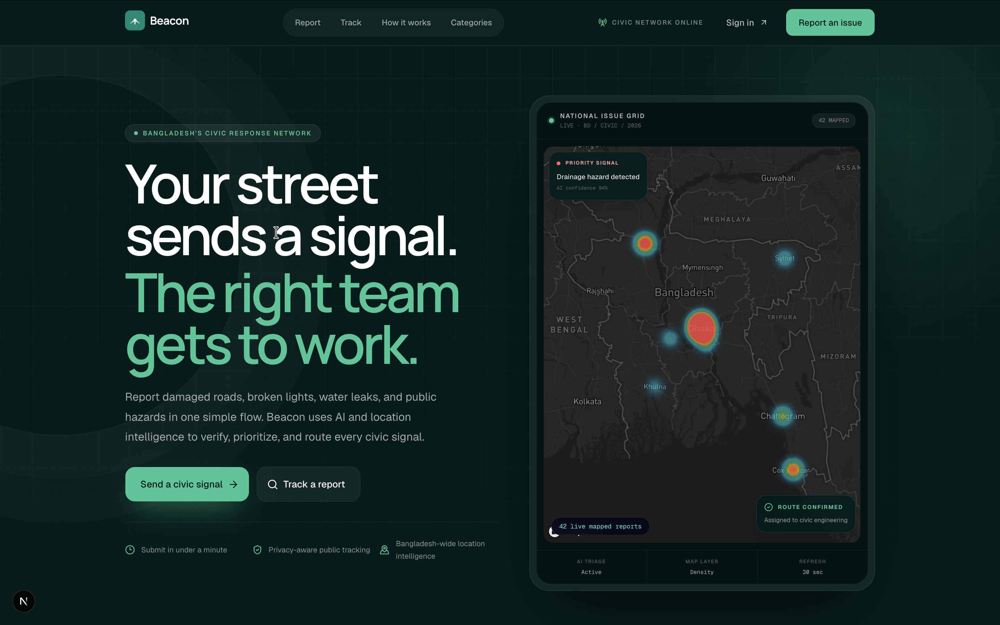
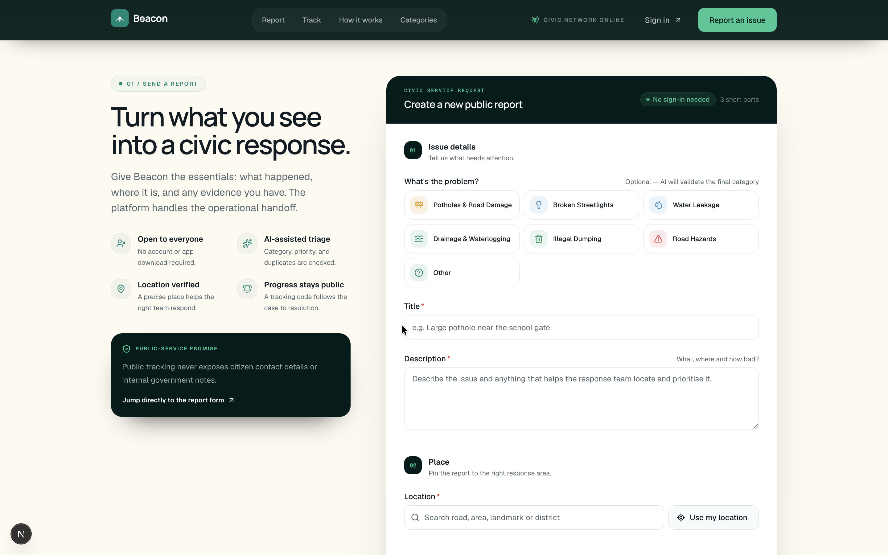
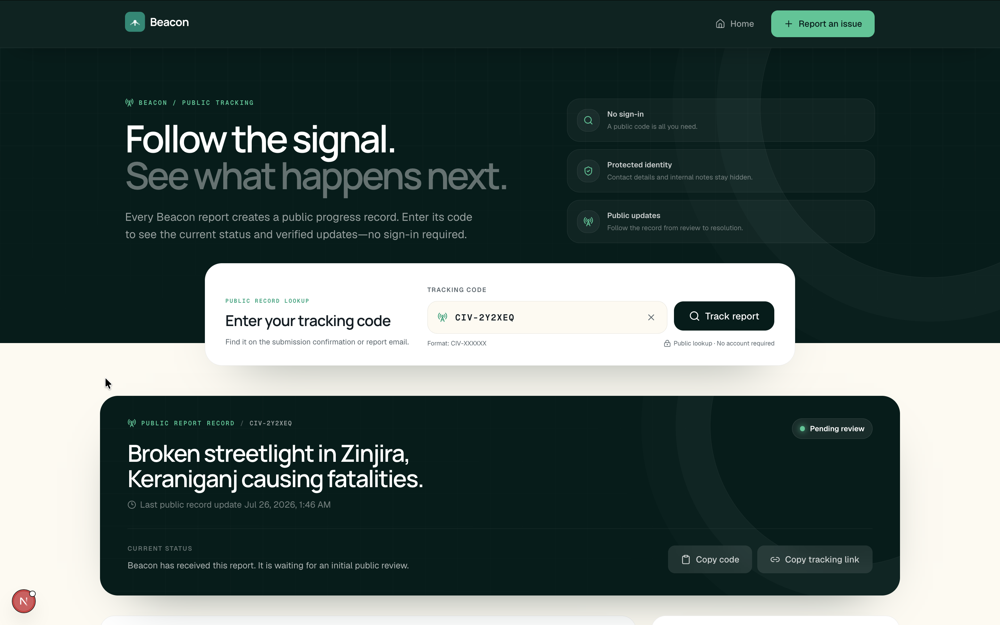
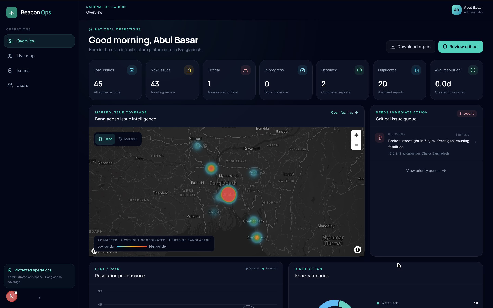
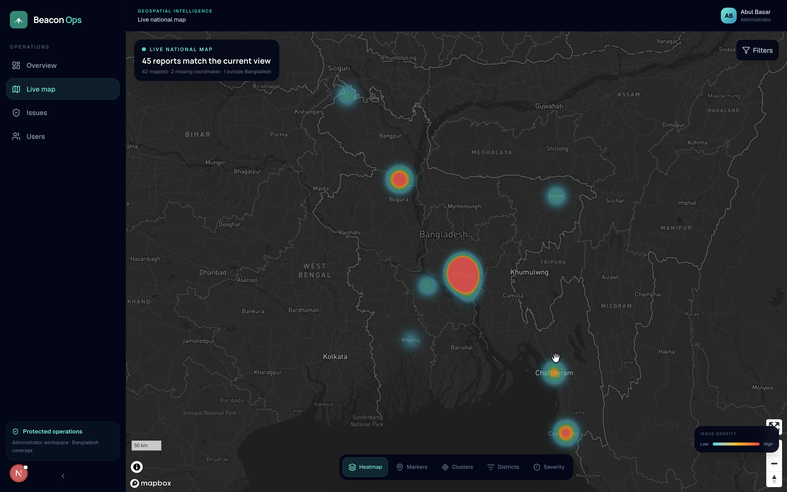
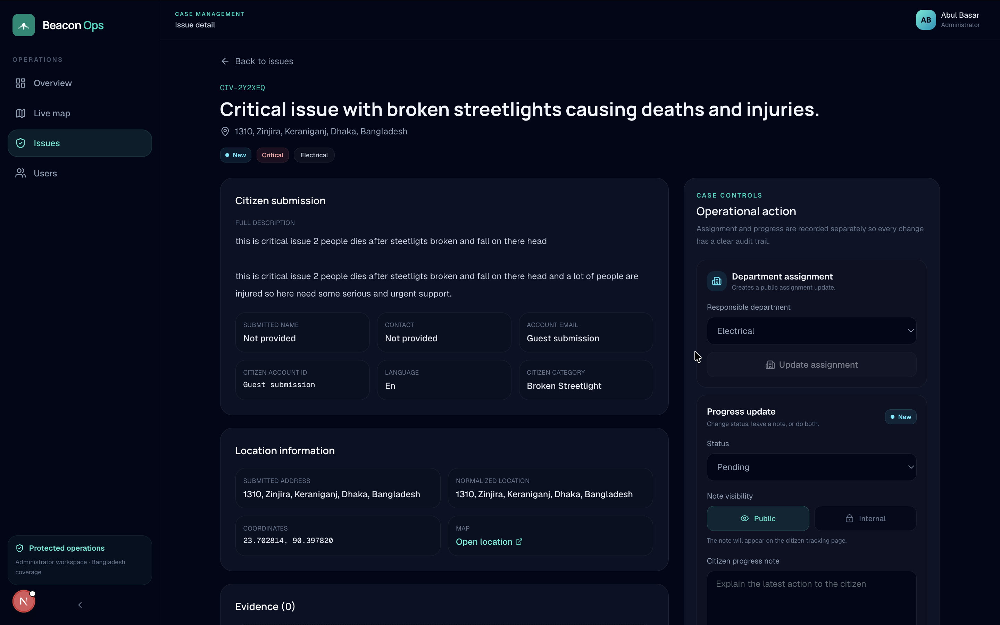

# Beacon — AI-Powered Civic Infrastructure Intelligence

> A citizen-friendly reporting experience and a government-grade operations
> platform for turning public infrastructure concerns into accountable action.

Beacon brings citizens, AI-assisted triage, and government response teams into
one transparent workflow. People can report and track local infrastructure
problems, while administrators can prioritize, map, assign, investigate, and
resolve cases through a national civic operations workspace.

Built for the **AI & API Hackathon 2026**, Beacon combines accessible public
service design with multimodal AI, duplicate detection, live geospatial
intelligence, and a complete report lifecycle.

**[Explore the live application](https://beacon-frontend-mu.vercel.app/)**
&nbsp;·&nbsp;
**[View the database ERD](https://drawsql.app/teams/abul-basar/diagrams/beacon)**
&nbsp;·&nbsp;
**[Browse the repository](https://github.com/AbulBashar38/beacon-frontend)**

## Product experience

### A clearer way to improve the places we share

Beacon opens with an approachable public experience that explains the mission,
builds trust, and guides citizens toward reporting or tracking an issue.



### Report infrastructure problems without friction

The guided reporting flow helps citizens describe the problem, add evidence,
select an accurate Bangladesh location, and review the submission before
sending it for analysis.



### Every report, update, and tracking code in one place

Signed-in citizens receive a calm, readable workspace for reviewing their
reports, current status, tracking codes, and the latest public progress.



### A civic operations command center

Administrators get a purpose-built national overview with operational metrics,
critical cases, AI-assisted insights, resolution performance, and mapped issue
coverage.



### Geospatial intelligence across Bangladesh

The live map supports marker, cluster, heatmap, district, and severity views,
with filters and location intelligence designed for rapid operational scanning.



### Accountable updates from assignment to resolution

Government operators can inspect the complete case record, assign the
responsible department, publish citizen-visible progress, and preserve internal
operational notes in a clear audit history.



---

## Repository scope

This repository contains the **Beacon Next.js frontend**. It connects to the
Beacon API through the configurable `NEXT_PUBLIC_API_BASE_URL`; the API service
source is maintained separately and is not included here.

## What Beacon does

### Citizen experience

- Submit a report without signing in
- Optionally create an account and retain a personal report history
- Upload photographic evidence and supporting URLs
- Find a structured address and select map coordinates
- Receive an internal report ID and public tracking code
- Copy both identifiers after submission
- Receive the identifiers by email when an email address is supplied
- Track public progress without signing in

### Government experience

- Secure administrator dashboard
- Live metrics, charts, report queue, and Bangladesh issue map
- Search, filter, sort, and paginate reports
- Inspect citizen input, images, AI analysis, duplicate links, and activity
- Assign a responsible department
- Update status and add public or internal progress notes
- Search and paginate users
- Download an overview PDF

## AI pipeline

Each submitted report passes through Beacon’s connected AI processing pipeline:

1. Validate and normalize the request with Zod.
2. Analyze the description, location, category hint, and uploaded images.
3. Generate an operational category, confidence, severity, rationale, summary,
   department, and suggested action.
4. Generate a semantic embedding from the canonical summary.
5. Compare recent records using semantic, category, geographic, and temporal
   similarity.
6. Link likely duplicates while retaining every submitted report.
7. Persist the report and initial public progress update.
8. Send a confirmation email when a valid recipient and SMTP configuration are
   available.

### Models

| Purpose | Default model | Reason |
| --- | --- | --- |
| Text and image triage | `gpt-4o-mini` | Fast, economical multimodal analysis |
| Triage fallback | `gpt-4o` | More capable fallback when the primary call fails |
| Duplicate embeddings | `text-embedding-3-small` | Semantic similarity across differently worded reports |

Models are configurable in the separately deployed API service. If AI is
unavailable, Beacon preserves the citizen submission with conservative
manual-review values instead of losing the report.

## Frontend technology

- Next.js 16 App Router, React 19, and TypeScript
- Tailwind CSS and customized shadcn/Radix primitives
- React Hook Form and Zod
- Axios
- Motion
- Recharts
- Mapbox GL through `react-map-gl/mapbox`
- Cloudinary unsigned uploads
- jsPDF

## Database design

The wider platform’s data relationships and report lifecycle entities are
documented in the
[Beacon entity-relationship diagram on DrawSQL](https://drawsql.app/teams/abul-basar/diagrams/beacon).

## Application routes

### Public and citizen routes

| Route | Purpose |
| --- | --- |
| `/` | Landing page, live map, and public report form |
| `/track` | Track a report using its public code |
| `/login` | Email/password login |
| `/register` | Citizen registration |
| `/forgot-password` | Password recovery interface |
| `/dashboard` | Signed-in citizen reports |

### Administrator routes

| Route | Purpose |
| --- | --- |
| `/admin/dashboard` | Operational overview |
| `/admin/map` | Filterable live map |
| `/admin/issues` | Searchable and paginated report table |
| `/admin/issues/[id]` | Complete report detail and management |
| `/admin/users` | User administration |

## Local setup

### Prerequisites

- Node.js 20 or later
- npm
- Public Mapbox token
- Cloudinary unsigned upload preset
- Access to a running Beacon API

### 1. Install dependencies

```bash
npm install
```

### 2. Configure the application

```bash
cp .env.example .env.local
```

Set:

```env
NEXT_PUBLIC_API_BASE_URL=http://localhost:8080/api/
APP_URL=http://localhost:3000
NEXT_PUBLIC_MAPBOX_ACCESS_TOKEN=pk.your_public_mapbox_token
NEXT_PUBLIC_MAP_STYLE_URL=mapbox://styles/mapbox/dark-v11
NEXT_PUBLIC_CLOUDINARY_CLOUD_NAME=your_cloud_name
NEXT_PUBLIC_CLOUDINARY_UPLOAD_PRESET=your_unsigned_upload_preset
# Optional: enables Google Search Console ownership verification.
GOOGLE_SITE_VERIFICATION=
```

Only a public `pk.` Mapbox token may be placed in a `NEXT_PUBLIC_` variable.
Set `APP_URL` to the canonical production origin when deploying so social
metadata, the sitemap, and structured data use the public domain.

### 3. Start the frontend

```bash
npm run dev
```

Open `http://localhost:3000`.

## Authentication and API access

- `POST /api/reports` is public. A valid optional citizen token links the report
  to that account; absent, expired, or invalid optional authentication continues
  as a guest submission.
- Public tracking and public map/landing data do not require login.
- Citizen history requires a valid citizen JWT.
- Report administration, analytics, and user listing require an administrator
  JWT.
- Authentication is stored in local or session storage according to the
  “Remember me” choice. Logout is handled by clearing the frontend session.

## Main API endpoints

### Public

| Method | Endpoint | Purpose |
| --- | --- | --- |
| `POST` | `/api/auth/register` | Create a citizen account |
| `POST` | `/api/auth/login` | Obtain a JWT |
| `POST` | `/api/reports` | Submit a report |
| `GET` | `/api/reports/track/:trackingCode` | Privacy-safe tracking |
| `GET` | `/api/reports/public/map` | Privacy-safe map points |
| `GET` | `/api/reports/public/landing` | Real landing-page metrics |
| `GET` | `/api/health` | Service health |

### Authenticated citizen

| Method | Endpoint | Purpose |
| --- | --- | --- |
| `GET` | `/api/auth/me` | Current user |
| `GET` | `/api/reports/mine` | Reports owned by the citizen |

### Administrator

| Method | Endpoint | Purpose |
| --- | --- | --- |
| `GET` | `/api/reports` | Filtered, sorted, paginated reports |
| `GET` | `/api/reports/stats/summary` | Dashboard analytics |
| `GET` | `/api/reports/:id` | Complete report detail |
| `PATCH` | `/api/reports/:id/status` | Update status |
| `PATCH` | `/api/reports/:id/assign` | Assign department |
| `POST` | `/api/reports/:id/progress` | Add progress update |
| `GET` | `/api/reports/:id/duplicates` | Duplicate chain |
| `DELETE` | `/api/reports/:id` | Soft-delete a report |
| `GET` | `/api/users` | Filtered and paginated users |

## Domain values

```text
Categories:  pothole, broken_streetlight, water_leak, illegal_dumping, other
Severity:    low, medium, high, critical
Status:      pending, under_review, assigned, in_progress, resolved, rejected
Departments: roads_and_highways, electrical, water_and_sewerage,
             waste_management, general
```

## Validation and testing

```bash
npm run lint
npm run build
```

## Important implementation notes

- Uploaded images are sent to the AI as vision inputs after Cloudinary upload.
- Evidence URLs are stored separately and are not assumed to be images.
- Public responses exclude citizen PII and internal progress notes.
- Administrators can see public and internal report history.
- The landing page uses real public API data and hides unavailable sections.
- The overview dashboard loads current API data once and supports manual retry;
  short polling is disabled.
- Never commit `.env` or `.env.local`.

## License

This hackathon project currently uses the repository’s package-level license
metadata. Add an explicit root `LICENSE` file before public distribution.
